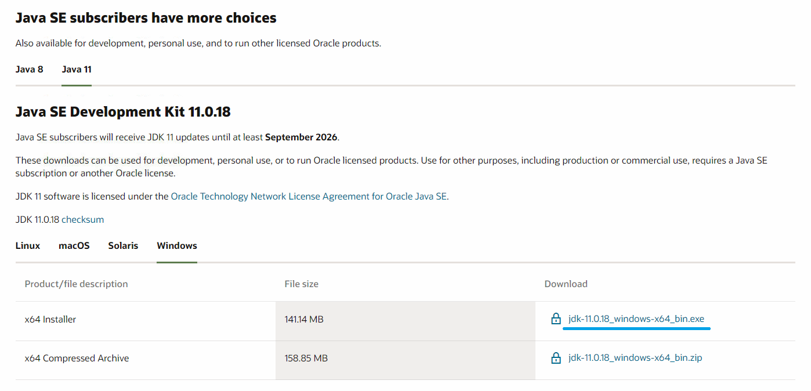
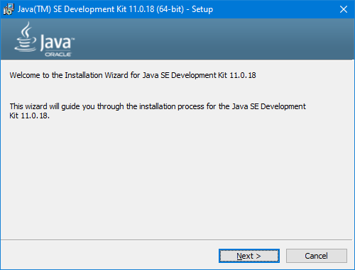
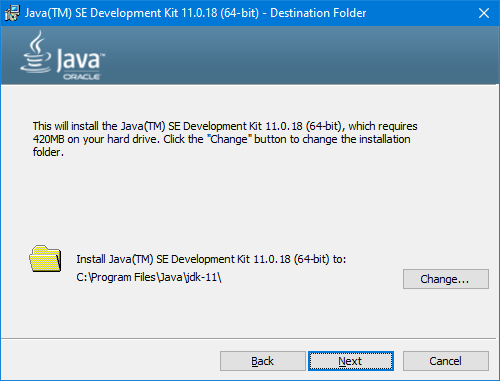
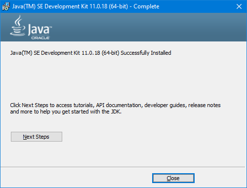

# 微服务系统架构设计课程准备

## 机器配置
1. Windows 操作系统
2. cpu: 2.9G 6核心
3. 内存: >=16G

## 软件安装
### [java11](https://www.oracle.com/java/technologies/downloads/#java11-windows)

#### JDK 11 Release Notes
https://www.oracle.com/java/technologies/javase/11u-relnotes.html

#### 下载
[JDK 11.0.18](https://www.oracle.com/java/technologies/downloads/#java11-windows)


#### 安装
  
  


### [IntelliJ IDEA](https://www.jetbrains.com/idea/download/?ij80pr#section=windows), Datbase Navigator Plugin


3. [Maven](https://maven.apache.org/download.cgi), [settings.xml](https://raw.githubusercontent.com/yuqisun/yuqisun.github.io/master/_posts/files/settings.xml)
4. [Git](https://git-scm.com/downloads)
5. [Docker](https://www.docker.com/), [WSL](https://learn.microsoft.com/en-us/windows/wsl/install-manual#step-4---download-the-linux-kernel-update-package)

### 在 Docker中启动 Mysql
1. 进入 Linux控制台
2. `docker pull mysql:latest`
3. `docker run -itd --name mysql-test -p 3306:3306 -e MYSQL_ROOT_PASSWORD=123456 mysql`

### 在 Docker中启动 Kafka
1. 进入 Linux控制台
2. 创建 [docker-compose.yml](https://raw.githubusercontent.com/yuqisun/yuqisun.github.io/master/_posts/files/docker-compose.yml)
3. `docker-compose up -d`
4. 创建主题
```shell
docker exec broker \
kafka-topics --bootstrap-server broker:9092 \
             --create \
             --topic quickstart
```

