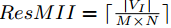

了解 Quarkus, GraavlVM 等。


## Install chocolatey
https://chocolatey.org/install
```shell
PS C:\Users\Administrator> Get-ExecutionPolicy
Restricted

PS C:\Users\Administrator> Set-ExecutionPolicy AllSigned

Execution Policy Change
The execution policy helps protect you from scripts that you do not trust. Changing the execution policy might expose
you to the security risks described in the about_Execution_Policies help topic at
https:/go.microsoft.com/fwlink/?LinkID=135170. Do you want to change the execution policy?
[Y] Yes  [A] Yes to All  [N] No  [L] No to All  [S] Suspend  [?] Help (default is "N"): Y

PS C:\Users\Administrator> Get-ExecutionPolicy
AllSigned

PS C:\Users\Administrator> Set-ExecutionPolicy Bypass -Scope Process -Force; [System.Net.ServicePointManager]::SecurityProtocol = [System.Net.ServicePointManager]::SecurityProtocol -bor 3072; iex ((New-Object System.Net.WebClient).DownloadString('https://community.chocolatey.org/install.ps1'))
Forcing web requests to allow TLS v1.2 (Required for requests to Chocolatey.org)
Getting latest version of the Chocolatey package for download.
Not using proxy.
Getting Chocolatey from https://community.chocolatey.org/api/v2/package/chocolatey/1.3.0.
Downloading https://community.chocolatey.org/api/v2/package/chocolatey/1.3.0 to C:\Users\ADMINI~1\AppData\Local\Temp\chocolatey\chocoInstall\chocolatey.zip
Not using proxy.
Extracting C:\Users\ADMINI~1\AppData\Local\Temp\chocolatey\chocoInstall\chocolatey.zip to C:\Users\ADMINI~1\AppData\Local\Temp\chocolatey\chocoInstall
Installing Chocolatey on the local machine
Creating ChocolateyInstall as an environment variable (targeting 'Machine')
Setting ChocolateyInstall to 'C:\ProgramData\chocolatey'
WARNING: It's very likely you will need to close and reopen your shell
before you can use choco.
Restricting write permissions to Administrators
We are setting up the Chocolatey package repository.
The packages themselves go to 'C:\ProgramData\chocolatey\lib'
(i.e. C:\ProgramData\chocolatey\lib\yourPackageName).
A shim file for the command line goes to 'C:\ProgramData\chocolatey\bin'
and points to an executable in 'C:\ProgramData\chocolatey\lib\yourPackageName'.

Creating Chocolatey folders if they do not already exist.

WARNING: You can safely ignore errors related to missing log files when
upgrading from a version of Chocolatey less than 0.9.9.
'Batch file could not be found' is also safe to ignore.
'The system cannot find the file specified' - also safe.
chocolatey.nupkg file not installed in lib.
Attempting to locate it from bootstrapper.
PATH environment variable does not have C:\ProgramData\chocolatey\bin in it. Adding...
WARNING: Not setting tab completion: Profile file does not exist at
'C:\Users\Administrator\Documents\WindowsPowerShell\Microsoft.PowerShell_profile.ps1'.
Chocolatey (choco.exe) is now ready.
You can call choco from anywhere, command line or powershell by typing choco.
Run choco /? for a list of functions.
You may need to shut down and restart powershell and/or consoles
first prior to using choco.
Ensuring Chocolatey commands are on the path
Ensuring chocolatey.nupkg is in the lib folder

PS C:\Users\Administrator> choco
Chocolatey v1.3.0
Please run 'choco -?' or 'choco <command> -?' for help menu.
```


## Install Quarkus
https://quarkus.io/guides/cli-tooling

```shell
PS C:\Users\Administrator> choco install quarkus
Chocolatey v1.3.0
Installing the following packages:
quarkus
By installing, you accept licenses for the packages.
Progress: Downloading quarkus 2.16.3... 100%

quarkus v2.16.3 [Approved]
quarkus package files install completed. Performing other installation steps.
The package quarkus wants to run 'chocolateyinstall.ps1'.
Note: If you don't run this script, the installation will fail.
Note: To confirm automatically next time, use '-y' or consider:
choco feature enable -n allowGlobalConfirmation
Do you want to run the script?([Y]es/[A]ll - yes to all/[N]o/[P]rint): Y

Using system proxy server '127.0.0.1:56098'.
Downloading quarkus
  from 'https://github.com/quarkusio/quarkus/releases/download/2.16.3.Final/quarkus-cli-2.16.3.Final.zip'
Using system proxy server '127.0.0.1:56098'.
Progress: 100% - Completed download of C:\Users\Administrator\AppData\Local\Temp\chocolatey\quarkus\2.16.3\quarkus-cli-2.16.3.Final.zip (19.84 MB).
Download of quarkus-cli-2.16.3.Final.zip (19.84 MB) completed.
Hashes match.
Extracting C:\Users\Administrator\AppData\Local\Temp\chocolatey\quarkus\2.16.3\quarkus-cli-2.16.3.Final.zip to C:\ProgramData\chocolatey\lib\quarkus...
C:\ProgramData\chocolatey\lib\quarkus
Added C:\ProgramData\chocolatey\bin\quarkus.exe shim pointed to '..\lib\quarkus\quarkus-cli-2.16.3.final\bin\quarkus.bat'.
 The install of quarkus was successful.
  Software installed to 'C:\ProgramData\chocolatey\lib\quarkus'

Chocolatey installed 1/1 packages.
 See the log for details (C:\ProgramData\chocolatey\logs\chocolatey.log).

PS C:\Users\Administrator> quarkus --version
2.16.3.Final
```


## create quarkus project
```shell
D:\SDisk\workspace\Java>quarkus create && cd code-with-quarkus
Creating an app (default project type, see --help).
Looking for the newly published extensions in registry.quarkus.io
-----------

applying codestarts...
>> java
>> maven
>> quarkus
>> config-properties
>> dockerfiles
>> maven-wrapper
>> resteasy-reactive-codestart

-----------
[SUCCESS] quarkus project has been successfully generated in:
--> D:\SDisk\workspace\Java\code-with-quarkus
-----------
Navigate into this directory and get started: quarkus dev
```

```shell
D:\SDisk\workspace\Java\code-with-quarkus>quarkus dev

Error: JAVA_HOME not found in your environment.
Please set the JAVA_HOME variable in your environment to match the
location of your Java installation.
```

Set JAVA_HOME
```shell
C:\Users\Administrator>echo %JAVA_HOME%
C:\Program Files\Java\jdk-17.0.5
```

## Start quarkus
```shell
D:\SDisk\workspace\Java\code-with-quarkus>quarkus dev
[INFO] Scanning for projects...
[INFO]
[INFO] ---------------------< org.acme:code-with-quarkus >---------------------
[INFO] Building code-with-quarkus 1.0.0-SNAPSHOT
[INFO] --------------------------------[ jar ]---------------------------------
[INFO]
[INFO] --- quarkus-maven-plugin:2.16.3.Final:dev (default-cli) @ code-with-quarkus ---
[INFO] Invoking org.apache.maven.plugins:maven-resources-plugin:2.6:resources @ code-with-quarkus
[INFO] Using 'UTF-8' encoding to copy filtered resources.
[INFO] Copying 2 resources
[INFO] Invoking io.quarkus.platform:quarkus-maven-plugin:2.16.3.Final:generate-code @ code-with-quarkus
[INFO] Invoking org.apache.maven.plugins:maven-compiler-plugin:3.10.1:compile @ code-with-quarkus
[INFO] Changes detected - recompiling the module!
[INFO] Compiling 1 source file to D:\SDisk\workspace\Java\code-with-quarkus\target\classes
[INFO] Invoking org.apache.maven.plugins:maven-resources-plugin:2.6:testResources @ code-with-quarkus
[INFO] Using 'UTF-8' encoding to copy filtered resources.
[INFO] skip non existing resourceDirectory D:\SDisk\workspace\Java\code-with-quarkus\src\test\resources
[INFO] Invoking io.quarkus.platform:quarkus-maven-plugin:2.16.3.Final:generate-code-tests @ code-with-quarkus
[INFO] Invoking org.apache.maven.plugins:maven-compiler-plugin:3.10.1:testCompile @ code-with-quarkus
[INFO] Changes detected - recompiling the module!
[INFO] Compiling 2 source files to D:\SDisk\workspace\Java\code-with-quarkus\target\test-classes
Listening for transport dt_socket at address: 5005
__  ____  __  _____   ___  __ ____  ______
 --/ __ \/ / / / _ | / _ \/ //_/ / / / __/
 -/ /_/ / /_/ / __ |/ , _/ ,< / /_/ /\ \
--\___\_\____/_/ |_/_/|_/_/|_|\____/___/
2023-02-25 07:40:29,296 INFO  [io.quarkus] (Quarkus Main Thread) code-with-quarkus 1.0.0-SNAPSHOT on JVM (powered by Quarkus 2.16.3.Final) started in 1.462s. Listening on: http://localhost:8080

2023-02-25 07:40:29,306 INFO  [io.quarkus] (Quarkus Main Thread) Profile dev activated. Live Coding activated.
2023-02-25 07:40:29,308 INFO  [io.quarkus] (Quarkus Main Thread) Installed features: [cdi, resteasy-reactive, smallrye-context-propagation, vertx]

--
Tests paused
Press [r] to resume testing, [o] Toggle test output, [:] for the terminal, [h] for more options>
```


quarkus 的使命就是建立出一个最小化的，少反射的项目，下面继续加速云原生应用的启动速度就得靠 GraalVM 把java 字节码继续静态编译成二进制码。

## 下载GraalVM 和 native-image jar
https://github.com/graalvm/graalvm-ce-builds/releases

解压 GraalVM，配置
```shell
export GRAALVM_HOME=$HOME/Development/graalvm/
可选 export JAVA_HOME=${GRAALVM_HOME}
可选 export PATH=${GRAALVM_HOME}/bin:$PATH
```

install native-image
```shell
D:\SDisk\app>%GRAALVM_HOME%/bin/gu install native-image-installable-svm-java17-windows-amd64-22.3.1.jar
Downloading: Component catalog from www.graalvm.org
Error: Component "native-image-installable-svm-java17-windows-amd64-22.3.1.jar" is not available in catalog.
Note: a file native-image-installable-svm-java17-windows-amd64-22.3.1.jar exists; to use component stored locally, use -L option
        gu -L <command> native-image-installable-svm-java17-windows-amd64-22.3.1.jar

D:\SDisk\app>%GRAALVM_HOME%/bin/gu install -L native-image-installable-svm-java17-windows-amd64-22.3.1.jar
Processing Component archive: native-image-installable-svm-java17-windows-amd64-22.3.1.jar
Installing new component: Native Image (org.graalvm.native-image, version 22.3.1)
```

## 未安装 Microsoft build tool 会报错
```shell
D:\SDisk\workspace\Java\quarkus-quickstarts-main\getting-started>mvnw install -Dnative
[INFO] Scanning for projects...
[INFO]
[INFO] ----------------------< org.acme:getting-started >----------------------
[INFO] Building getting-started 1.0.0-SNAPSHOT
[INFO] --------------------------------[ jar ]---------------------------------
[INFO]
[INFO] --- maven-resources-plugin:2.6:resources (default-resources) @ getting-started ---
[INFO] Using 'UTF-8' encoding to copy filtered resources.
[INFO] Copying 2 resources
[INFO]
[INFO] --- maven-compiler-plugin:3.8.1:compile (default-compile) @ getting-started ---
[INFO] Changes detected - recompiling the module!
[INFO] Compiling 2 source files to D:\SDisk\workspace\Java\quarkus-quickstarts-main\getting-started\target\classes
[INFO]
[INFO] --- maven-resources-plugin:2.6:testResources (default-testResources) @ getting-started ---
[INFO] Using 'UTF-8' encoding to copy filtered resources.
[INFO] skip non existing resourceDirectory D:\SDisk\workspace\Java\quarkus-quickstarts-main\getting-started\src\test\resources
[INFO]
[INFO] --- maven-compiler-plugin:3.8.1:testCompile (default-testCompile) @ getting-started ---
[INFO] Changes detected - recompiling the module!
[INFO] Compiling 2 source files to D:\SDisk\workspace\Java\quarkus-quickstarts-main\getting-started\target\test-classes
[INFO]
[INFO] --- maven-surefire-plugin:3.0.0-M7:test (default-test) @ getting-started ---
[INFO] Using auto detected provider org.apache.maven.surefire.junitplatform.JUnitPlatformProvider
Downloading from alimaven: http://maven.aliyun.com/nexus/content/repositories/central/org/apache/maven/surefire/surefire-junit-platform/3.0.0-M7/surefire-junit-platform-3.0.0-M7.jar
Downloaded from alimaven: http://maven.aliyun.com/nexus/content/repositories/central/org/apache/maven/surefire/surefire-junit-platform/3.0.0-M7/surefire-junit-platform-3.0.0-M7.jar (26 kB at 35 kB/s)
Downloading from alimaven: http://maven.aliyun.com/nexus/content/repositories/central/org/apache/maven/surefire/surefire-junit-platform/3.0.0-M7/surefire-junit-platform-3.0.0-M7.pom
Downloaded from alimaven: http://maven.aliyun.com/nexus/content/repositories/central/org/apache/maven/surefire/surefire-junit-platform/3.0.0-M7/surefire-junit-platform-3.0.0-M7.pom (5.3 kB at 24 kB/s)
Downloading from alimaven: http://maven.aliyun.com/nexus/content/repositories/central/org/apache/maven/surefire/surefire-providers/3.0.0-M7/surefire-providers-3.0.0-M7.pom
Downloaded from alimaven: http://maven.aliyun.com/nexus/content/repositories/central/org/apache/maven/surefire/surefire-providers/3.0.0-M7/surefire-providers-3.0.0-M7.pom (2.5 kB at 13 kB/s)
Downloading from alimaven: http://maven.aliyun.com/nexus/content/repositories/central/org/apache/maven/surefire/common-java5/3.0.0-M7/common-java5-3.0.0-M7.pom
Downloaded from alimaven: http://maven.aliyun.com/nexus/content/repositories/central/org/apache/maven/surefire/common-java5/3.0.0-M7/common-java5-3.0.0-M7.pom (2.7 kB at 13 kB/s)
Downloading from alimaven: http://maven.aliyun.com/nexus/content/repositories/central/org/junit/platform/junit-platform-launcher/1.3.2/junit-platform-launcher-1.3.2.pom
Downloaded from alimaven: http://maven.aliyun.com/nexus/content/repositories/central/org/junit/platform/junit-platform-launcher/1.3.2/junit-platform-launcher-1.3.2.pom (2.2 kB at 11 kB/s)
Downloading from alimaven: http://maven.aliyun.com/nexus/content/repositories/central/org/apiguardian/apiguardian-api/1.0.0/apiguardian-api-1.0.0.pom
Downloaded from alimaven: http://maven.aliyun.com/nexus/content/repositories/central/org/apiguardian/apiguardian-api/1.0.0/apiguardian-api-1.0.0.pom (1.2 kB at 6.1 kB/s)
Downloading from alimaven: http://maven.aliyun.com/nexus/content/repositories/central/org/junit/platform/junit-platform-engine/1.3.2/junit-platform-engine-1.3.2.pom
Downloaded from alimaven: http://maven.aliyun.com/nexus/content/repositories/central/org/junit/platform/junit-platform-engine/1.3.2/junit-platform-engine-1.3.2.pom (2.4 kB at 13 kB/s)
Downloading from alimaven: http://maven.aliyun.com/nexus/content/repositories/central/org/junit/platform/junit-platform-commons/1.3.2/junit-platform-commons-1.3.2.pom
Downloaded from alimaven: http://maven.aliyun.com/nexus/content/repositories/central/org/junit/platform/junit-platform-commons/1.3.2/junit-platform-commons-1.3.2.pom (2.0 kB at 11 kB/s)
Downloading from alimaven: http://maven.aliyun.com/nexus/content/repositories/central/org/opentest4j/opentest4j/1.1.1/opentest4j-1.1.1.pom
Downloaded from alimaven: http://maven.aliyun.com/nexus/content/repositories/central/org/opentest4j/opentest4j/1.1.1/opentest4j-1.1.1.pom (1.7 kB at 9.0 kB/s)
Downloading from alimaven: http://maven.aliyun.com/nexus/content/repositories/central/org/junit/jupiter/junit-jupiter-engine/5.3.2/junit-jupiter-engine-5.3.2.pom
Downloaded from alimaven: http://maven.aliyun.com/nexus/content/repositories/central/org/junit/jupiter/junit-jupiter-engine/5.3.2/junit-jupiter-engine-5.3.2.pom (2.4 kB at 14 kB/s)
Downloading from alimaven: http://maven.aliyun.com/nexus/content/repositories/central/org/junit/jupiter/junit-jupiter-api/5.3.2/junit-jupiter-api-5.3.2.pom
Downloaded from alimaven: http://maven.aliyun.com/nexus/content/repositories/central/org/junit/jupiter/junit-jupiter-api/5.3.2/junit-jupiter-api-5.3.2.pom (2.4 kB at 13 kB/s)
Downloading from alimaven: http://maven.aliyun.com/nexus/content/repositories/central/org/junit/jupiter/junit-jupiter-params/5.3.2/junit-jupiter-params-5.3.2.pom
Downloaded from alimaven: http://maven.aliyun.com/nexus/content/repositories/central/org/junit/jupiter/junit-jupiter-params/5.3.2/junit-jupiter-params-5.3.2.pom (2.2 kB at 13 kB/s)
Downloading from alimaven: http://maven.aliyun.com/nexus/content/repositories/central/org/mockito/mockito-core/2.28.2/mockito-core-2.28.2.pom
Downloaded from alimaven: http://maven.aliyun.com/nexus/content/repositories/central/org/mockito/mockito-core/2.28.2/mockito-core-2.28.2.pom (20 kB at 98 kB/s)
Downloading from alimaven: http://maven.aliyun.com/nexus/content/repositories/central/net/bytebuddy/byte-buddy/1.9.10/byte-buddy-1.9.10.pom
Downloaded from alimaven: http://maven.aliyun.com/nexus/content/repositories/central/net/bytebuddy/byte-buddy/1.9.10/byte-buddy-1.9.10.pom (10 kB at 49 kB/s)
Downloading from alimaven: http://maven.aliyun.com/nexus/content/repositories/central/net/bytebuddy/byte-buddy-parent/1.9.10/byte-buddy-parent-1.9.10.pom
Downloaded from alimaven: http://maven.aliyun.com/nexus/content/repositories/central/net/bytebuddy/byte-buddy-parent/1.9.10/byte-buddy-parent-1.9.10.pom (36 kB at 161 kB/s)
Downloading from alimaven: http://maven.aliyun.com/nexus/content/repositories/central/net/bytebuddy/byte-buddy-agent/1.9.10/byte-buddy-agent-1.9.10.pom
Downloaded from alimaven: http://maven.aliyun.com/nexus/content/repositories/central/net/bytebuddy/byte-buddy-agent/1.9.10/byte-buddy-agent-1.9.10.pom (6.0 kB at 30 kB/s)
Downloading from alimaven: http://maven.aliyun.com/nexus/content/repositories/central/org/objenesis/objenesis/2.6/objenesis-2.6.pom
Downloaded from alimaven: http://maven.aliyun.com/nexus/content/repositories/central/org/objenesis/objenesis/2.6/objenesis-2.6.pom (2.8 kB at 16 kB/s)
Downloading from alimaven: http://maven.aliyun.com/nexus/content/repositories/central/org/objenesis/objenesis-parent/2.6/objenesis-parent-2.6.pom
Downloaded from alimaven: http://maven.aliyun.com/nexus/content/repositories/central/org/objenesis/objenesis-parent/2.6/objenesis-parent-2.6.pom (17 kB at 92 kB/s)
Downloading from alimaven: http://maven.aliyun.com/nexus/content/repositories/central/org/powermock/powermock-reflect/2.0.9/powermock-reflect-2.0.9.pom
Downloaded from alimaven: http://maven.aliyun.com/nexus/content/repositories/central/org/powermock/powermock-reflect/2.0.9/powermock-reflect-2.0.9.pom (7.9 kB at 39 kB/s)
Downloading from alimaven: http://maven.aliyun.com/nexus/content/repositories/central/net/bytebuddy/byte-buddy/1.10.14/byte-buddy-1.10.14.pom
Downloaded from alimaven: http://maven.aliyun.com/nexus/content/repositories/central/net/bytebuddy/byte-buddy/1.10.14/byte-buddy-1.10.14.pom (11 kB at 59 kB/s)
Downloading from alimaven: http://maven.aliyun.com/nexus/content/repositories/central/net/bytebuddy/byte-buddy-parent/1.10.14/byte-buddy-parent-1.10.14.pom
Downloaded from alimaven: http://maven.aliyun.com/nexus/content/repositories/central/net/bytebuddy/byte-buddy-parent/1.10.14/byte-buddy-parent-1.10.14.pom (41 kB at 218 kB/s)
Downloading from alimaven: http://maven.aliyun.com/nexus/content/repositories/central/net/bytebuddy/byte-buddy-agent/1.10.14/byte-buddy-agent-1.10.14.pom
Downloaded from alimaven: http://maven.aliyun.com/nexus/content/repositories/central/net/bytebuddy/byte-buddy-agent/1.10.14/byte-buddy-agent-1.10.14.pom (9.6 kB at 51 kB/s)
Downloading from alimaven: http://maven.aliyun.com/nexus/content/repositories/central/junit/junit/4.13.2/junit-4.13.2.pom
Downloaded from alimaven: http://maven.aliyun.com/nexus/content/repositories/central/junit/junit/4.13.2/junit-4.13.2.pom (27 kB at 140 kB/s)
Downloading from alimaven: http://maven.aliyun.com/nexus/content/repositories/central/org/hamcrest/hamcrest-library/1.3/hamcrest-library-1.3.pom
Downloaded from alimaven: http://maven.aliyun.com/nexus/content/repositories/central/org/hamcrest/hamcrest-library/1.3/hamcrest-library-1.3.pom (820 B at 4.4 kB/s)
Downloading from alimaven: http://maven.aliyun.com/nexus/content/repositories/central/org/junit/junit-bom/5.8.0/junit-bom-5.8.0.pom
Downloaded from alimaven: http://maven.aliyun.com/nexus/content/repositories/central/org/junit/junit-bom/5.8.0/junit-bom-5.8.0.pom (5.6 kB at 32 kB/s)
Downloading from alimaven: http://maven.aliyun.com/nexus/content/repositories/central/org/junit/platform/junit-platform-engine/1.3.2/junit-platform-engine-1.3.2.jar
Downloading from alimaven: http://maven.aliyun.com/nexus/content/repositories/central/org/junit/platform/junit-platform-commons/1.3.2/junit-platform-commons-1.3.2.jar
Downloading from alimaven: http://maven.aliyun.com/nexus/content/repositories/central/org/apache/maven/surefire/common-java5/3.0.0-M7/common-java5-3.0.0-M7.jar
Downloading from alimaven: http://maven.aliyun.com/nexus/content/repositories/central/org/junit/platform/junit-platform-launcher/1.3.2/junit-platform-launcher-1.3.2.jar
Downloading from alimaven: http://maven.aliyun.com/nexus/content/repositories/central/org/apiguardian/apiguardian-api/1.0.0/apiguardian-api-1.0.0.jar
Downloaded from alimaven: http://maven.aliyun.com/nexus/content/repositories/central/org/junit/platform/junit-platform-engine/1.3.2/junit-platform-engine-1.3.2.jar (138 kB at 669 kB/s)
Downloading from alimaven: http://maven.aliyun.com/nexus/content/repositories/central/org/opentest4j/opentest4j/1.1.1/opentest4j-1.1.1.jar
Downloaded from alimaven: http://maven.aliyun.com/nexus/content/repositories/central/org/junit/platform/junit-platform-commons/1.3.2/junit-platform-commons-1.3.2.jar (78 kB at 291 kB/s)
Downloaded from alimaven: http://maven.aliyun.com/nexus/content/repositories/central/org/apiguardian/apiguardian-api/1.0.0/apiguardian-api-1.0.0.jar (2.2 kB at 6.3 kB/s)
Downloaded from alimaven: http://maven.aliyun.com/nexus/content/repositories/central/org/apache/maven/surefire/common-java5/3.0.0-M7/common-java5-3.0.0-M7.jar (17 kB at 47 kB/s)
Downloaded from alimaven: http://maven.aliyun.com/nexus/content/repositories/central/org/opentest4j/opentest4j/1.1.1/opentest4j-1.1.1.jar (7.1 kB at 38 kB/s)
Downloaded from alimaven: http://maven.aliyun.com/nexus/content/repositories/central/org/junit/platform/junit-platform-launcher/1.3.2/junit-platform-launcher-1.3.2.jar (95 kB at 218 kB/s)
[INFO]
[INFO] -------------------------------------------------------
[INFO]  T E S T S
[INFO] -------------------------------------------------------
[INFO] Running org.acme.getting.started.GreetingResourceTest
Downloading from alimaven: http://maven.aliyun.com/nexus/content/repositories/central/io/quarkus/quarkus-bom-quarkus-platform-properties/2.16.3.Final/quarkus-bom-quarkus-platform-properties-2.16.3.Final.properties
Downloaded from alimaven: http://maven.aliyun.com/nexus/content/repositories/central/io/quarkus/quarkus-bom-quarkus-platform-properties/2.16.3.Final/quarkus-bom-quarkus-platform-properties-2.16.3.Final.properties (45 B at 77 B/s)
2023-02-25 23:45:41,559 INFO  [io.quarkus] (main) getting-started 1.0.0-SNAPSHOT on JVM (powered by Quarkus 2.16.3.Final) started in 1.587s. Listening on: http://localhost:8081
2023-02-25 23:45:41,562 INFO  [io.quarkus] (main) Profile test activated.
2023-02-25 23:45:41,562 INFO  [io.quarkus] (main) Installed features: [cdi, resteasy-reactive, smallrye-context-propagation, vertx]
[INFO] Tests run: 2, Failures: 0, Errors: 0, Skipped: 0, Time elapsed: 5.065 s - in org.acme.getting.started.GreetingResourceTest
2023-02-25 23:45:42,572 INFO  [io.quarkus] (main) getting-started stopped in 0.022s
[INFO]
[INFO] Results:
[INFO]
[INFO] Tests run: 2, Failures: 0, Errors: 0, Skipped: 0
[INFO]
[INFO]
[INFO] --- maven-jar-plugin:2.4:jar (default-jar) @ getting-started ---
[INFO] Building jar: D:\SDisk\workspace\Java\quarkus-quickstarts-main\getting-started\target\getting-started-1.0.0-SNAPSHOT.jar
[INFO]
[INFO] --- quarkus-maven-plugin:2.16.3.Final:build (default) @ getting-started ---
[INFO] [io.quarkus.deployment.pkg.steps.JarResultBuildStep] Building native image source jar: D:\SDisk\workspace\Java\quarkus-quickstarts-main\getting-started\target\getting-started-1.0.0-SNAPSHOT-native-image-source-jar\getting-started-1.0.0-SNAPSHOT-runner.jar
[INFO] [io.quarkus.deployment.pkg.steps.NativeImageBuildStep] Building native image from D:\SDisk\workspace\Java\quarkus-quickstarts-main\getting-started\target\getting-started-1.0.0-SNAPSHOT-native-image-source-jar\getting-started-1.0.0-SNAPSHOT-runner.jar
[INFO] [io.quarkus.deployment.pkg.steps.NativeImageBuildStep] Running Quarkus native-image plugin on GraalVM 22.3.1 Java 17 CE (Java Version 17.0.6+10-jvmci-22.3-b13)
[INFO] [io.quarkus.deployment.pkg.steps.NativeImageBuildRunner] D:\SDisk\app\graalvm-ce-java17-22.3.1\bin\native-image.cmd -J-Dsun.nio.ch.maxUpdateArraySize=100 -J-Djava.util.logging.manager=org.jboss.logmanager.LogManager -J-Dlogging.initial-configurator.min-level=500 -J-Dvertx.logger-delegate-factory-class-name=io.quarkus.vertx.core.runtime.VertxLogDelegateFactory -J-Dvertx.disableDnsResolver=true -J-Dio.netty.noUnsafe=true -J-Dio.netty.leakDetection.level=DISABLED -J-Dio.netty.allocator.maxOrder=3 -J-Duser.language=en -J-Duser.country=US -J-Dfile.encoding=UTF-8 --features=io.quarkus.runner.Feature,io.quarkus.runtime.graal.ResourcesFeature,io.quarkus.runtime.graal.DisableLoggingFeature -J--add-exports=java.security.jgss/sun.security.krb5=ALL-UNNAMED -J--add-opens=java.base/java.text=ALL-UNNAMED -J--add-opens=java.base/java.io=ALL-UNNAMED -J--add-opens=java.base/java.lang.invoke=ALL-UNNAMED -J--add-opens=java.base/java.util=ALL-UNNAMED -H:+CollectImageBuildStatistics -H:ImageBuildStatisticsFile=getting-started-1.0.0-SNAPSHOT-runner-timing-stats.json -H:BuildOutputJSONFile=getting-started-1.0.0-SNAPSHOT-runner-build-output-stats.json -H:+AllowFoldMethods -J-Djava.awt.headless=true --no-fallback --link-at-build-time -H:+ReportExceptionStackTraces -H:-AddAllCharsets --enable-url-protocols=http -H:-UseServiceLoaderFeature -H:+StackTrace -J--add-exports=org.graalvm.sdk/org.graalvm.nativeimage.impl=ALL-UNNAMED -J--add-exports=org.graalvm.nativeimage.builder/com.oracle.svm.core.jdk=ALL-UNNAMED --exclude-config io\.netty\.netty-codec /META-INF/native-image/io\.netty/netty-codec/generated/handlers/reflect-config\.json --exclude-config io\.netty\.netty-handler /META-INF/native-image/io\.netty/netty-handler/generated/handlers/reflect-config\.json getting-started-1.0.0-SNAPSHOT-runner -jar getting-started-1.0.0-SNAPSHOT-runner.jar
========================================================================================================================GraalVM Native Image: Generating 'getting-started-1.0.0-SNAPSHOT-runner' (executable)...
========================================================================================================================
[1/7] Initializing...                                                                                    (0.0s @ 0.21GB)Error: Default native-compiler executable 'cl.exe' not found via environment variable PATH
Error: To prevent native-toolchain checking provide command-line option -H:-CheckToolchain
com.oracle.svm.core.util.UserError$UserException: Default native-compiler executable 'cl.exe' not found via environment variable PATH
To prevent native-toolchain checking provide command-line option -H:-CheckToolchain
        at org.graalvm.nativeimage.builder/com.oracle.svm.core.util.UserError.abort(UserError.java:139)
        at org.graalvm.nativeimage.builder/com.oracle.svm.hosted.c.codegen.CCompilerInvoker.addSkipCheckingInfo(CCompilerInvoker.java:104)
        at org.graalvm.nativeimage.builder/com.oracle.svm.hosted.c.codegen.CCompilerInvoker.<init>(CCompilerInvoker.java:72)
        at org.graalvm.nativeimage.builder/com.oracle.svm.hosted.c.codegen.CCompilerInvoker$WindowsCCompilerInvoker.<init>(CCompilerInvoker.java:110)
        at org.graalvm.nativeimage.builder/com.oracle.svm.hosted.c.codegen.CCompilerInvoker.create(CCompilerInvoker.java:84)
        at org.graalvm.nativeimage.builder/com.oracle.svm.hosted.NativeImageGenerator.setupNativeImage(NativeImageGenerator.java:910)
        at org.graalvm.nativeimage.builder/com.oracle.svm.hosted.NativeImageGenerator.doRun(NativeImageGenerator.java:575)
        at org.graalvm.nativeimage.builder/com.oracle.svm.hosted.NativeImageGenerator.run(NativeImageGenerator.java:535)        at org.graalvm.nativeimage.builder/com.oracle.svm.hosted.NativeImageGeneratorRunner.buildImage(NativeImageGeneratorRunner.java:403)
        at org.graalvm.nativeimage.builder/com.oracle.svm.hosted.NativeImageGeneratorRunner.build(NativeImageGeneratorRunner.java:580)
        at org.graalvm.nativeimage.builder/com.oracle.svm.hosted.NativeImageGeneratorRunner.main(NativeImageGeneratorRunner.java:128)
------------------------------------------------------------------------------------------------------------------------                         0.2s (4.3% of total time) in 8 GCs | Peak RSS: 0.66GB | CPU load: 2.71
========================================================================================================================Failed generating 'getting-started-1.0.0-SNAPSHOT-runner' after 3.7s.
Error: Image build request failed with exit status 1
[INFO] ------------------------------------------------------------------------
[INFO] BUILD FAILURE
[INFO] ------------------------------------------------------------------------
[INFO] Total time:  22.764 s
[INFO] Finished at: 2023-02-25T23:45:50+08:00
[INFO] ------------------------------------------------------------------------
[ERROR] Failed to execute goal io.quarkus:quarkus-maven-plugin:2.16.3.Final:build (default) on project getting-started: Failed to build quarkus application: io.quarkus.builder.BuildException: Build failure: Build failed due to errors
[ERROR]         [error]: Build step io.quarkus.deployment.pkg.steps.NativeImageBuildStep#build threw an exception: io.quarkus.deployment.pkg.steps.NativeImageBuildStep$ImageGenerationFailureException: Image generation failed. Exit code: 1
[ERROR]         at io.quarkus.deployment.pkg.steps.NativeImageBuildStep.imageGenerationFailed(NativeImageBuildStep.java:422)
[ERROR]         at io.quarkus.deployment.pkg.steps.NativeImageBuildStep.build(NativeImageBuildStep.java:263)
[ERROR]         at java.base/jdk.internal.reflect.NativeMethodAccessorImpl.invoke0(Native Method)
[ERROR]         at java.base/jdk.internal.reflect.NativeMethodAccessorImpl.invoke(NativeMethodAccessorImpl.java:77)
[ERROR]         at java.base/jdk.internal.reflect.DelegatingMethodAccessorImpl.invoke(DelegatingMethodAccessorImpl.java:43)
[ERROR]         at java.base/java.lang.reflect.Method.invoke(Method.java:568)
[ERROR]         at io.quarkus.deployment.ExtensionLoader$3.execute(ExtensionLoader.java:909)
[ERROR]         at io.quarkus.builder.BuildContext.run(BuildContext.java:281)
[ERROR]         at org.jboss.threads.ContextHandler$1.runWith(ContextHandler.java:18)
[ERROR]         at org.jboss.threads.EnhancedQueueExecutor$Task.run(EnhancedQueueExecutor.java:2449)
[ERROR]         at org.jboss.threads.EnhancedQueueExecutor$ThreadBody.run(EnhancedQueueExecutor.java:1478)
[ERROR]         at java.base/java.lang.Thread.run(Thread.java:833)
[ERROR]         at org.jboss.threads.JBossThread.run(JBossThread.java:501)
[ERROR] -> [Help 1]
[ERROR]
[ERROR] To see the full stack trace of the errors, re-run Maven with the -e switch.
[ERROR] Re-run Maven using the -X switch to enable full debug logging.
[ERROR]
[ERROR] For more information about the errors and possible solutions, please read the following articles:
[ERROR] [Help 1] http://cwiki.apache.org/confluence/display/MAVEN/MojoExecutionException

D:\SDisk\workspace\Java\quarkus-quickstarts-main\getting-started>

```


## install VS build tool



为啥需要这个build tool？


## Build native-image

open x64 Native Tools Command Prompt
```shell
D:\SDisk>cd workspace\Java\quarkus-quickstarts-main\getting-started

D:\SDisk\workspace\Java\quarkus-quickstarts-main\getting-started>mvnw package -Pnative
[INFO] Scanning for projects...
[INFO]
[INFO] ----------------------< org.acme:getting-started >----------------------
[INFO] Building getting-started 1.0.0-SNAPSHOT
[INFO] --------------------------------[ jar ]---------------------------------
[INFO]
[INFO] --- maven-resources-plugin:2.6:resources (default-resources) @ getting-started ---
[INFO] Using 'UTF-8' encoding to copy filtered resources.
[INFO] Copying 2 resources
[INFO]
[INFO] --- maven-compiler-plugin:3.8.1:compile (default-compile) @ getting-started ---
[INFO] Nothing to compile - all classes are up to date
[INFO]
[INFO] --- maven-resources-plugin:2.6:testResources (default-testResources) @ getting-started ---
[INFO] Using 'UTF-8' encoding to copy filtered resources.
[INFO] skip non existing resourceDirectory D:\SDisk\workspace\Java\quarkus-quickstarts-main\getting-started\src\test\resources
[INFO]
[INFO] --- maven-compiler-plugin:3.8.1:testCompile (default-testCompile) @ getting-started ---
[INFO] Nothing to compile - all classes are up to date
[INFO]
[INFO] --- maven-surefire-plugin:3.0.0-M7:test (default-test) @ getting-started ---
[INFO] Using auto detected provider org.apache.maven.surefire.junitplatform.JUnitPlatformProvider
[INFO]
[INFO] -------------------------------------------------------
[INFO]  T E S T S
[INFO] -------------------------------------------------------
[INFO] Running org.acme.getting.started.GreetingResourceTest
2023-02-26 00:22:49,230 INFO  [io.quarkus] (main) getting-started 1.0.0-SNAPSHOT on JVM (powered by Quarkus 2.16.3.Final) started in 1.403s. Listening on: http://localhost:8081
2023-02-26 00:22:49,232 INFO  [io.quarkus] (main) Profile test activated.
2023-02-26 00:22:49,232 INFO  [io.quarkus] (main) Installed features: [cdi, resteasy-reactive, smallrye-context-propagation, vertx]
[INFO] Tests run: 2, Failures: 0, Errors: 0, Skipped: 0, Time elapsed: 2.828 s - in org.acme.getting.started.GreetingResourceTest
2023-02-26 00:22:50,134 INFO  [io.quarkus] (main) getting-started stopped in 0.023s
[INFO]
[INFO] Results:
[INFO]
[INFO] Tests run: 2, Failures: 0, Errors: 0, Skipped: 0
[INFO]
[INFO]
[INFO] --- maven-jar-plugin:2.4:jar (default-jar) @ getting-started ---
[INFO]
[INFO] --- quarkus-maven-plugin:2.16.3.Final:build (default) @ getting-started ---
[INFO] [io.quarkus.deployment.pkg.steps.JarResultBuildStep] Building native image source jar: D:\SDisk\workspace\Java\quarkus-quickstarts-main\getting-started\target\getting-started-1.0.0-SNAPSHOT-native-image-source-jar\getting-started-1.0.0-SNAPSHOT-runner.jar
[INFO] [io.quarkus.deployment.pkg.steps.NativeImageBuildStep] Building native image from D:\SDisk\workspace\Java\quarkus-quickstarts-main\getting-started\target\getting-started-1.0.0-SNAPSHOT-native-image-source-jar\getting-started-1.0.0-SNAPSHOT-runner.jar
[INFO] [io.quarkus.deployment.pkg.steps.NativeImageBuildStep] Running Quarkus native-image plugin on GraalVM 22.3.1 Java 17 CE (Java Version 17.0.6+10-jvmci-22.3-b13)
[INFO] [io.quarkus.deployment.pkg.steps.NativeImageBuildRunner] D:\SDisk\app\graalvm-ce-java17-22.3.1\bin\native-image.cmd -J-Dsun.nio.ch.maxUpdateArraySize=100 -J-Djava.util.logging.manager=org.jboss.logmanager.LogManager -J-Dlogging.initial-configurator.min-level=500 -J-Dvertx.logger-delegate-factory-class-name=io.quarkus.vertx.core.runtime.VertxLogDelegateFactory -J-Dvertx.disableDnsResolver=true -J-Dio.netty.noUnsafe=true -J-Dio.netty.leakDetection.level=DISABLED -J-Dio.netty.allocator.maxOrder=3 -J-Duser.language=en -J-Duser.country=US -J-Dfile.encoding=UTF-8 --features=io.quarkus.runner.Feature,io.quarkus.runtime.graal.ResourcesFeature,io.quarkus.runtime.graal.DisableLoggingFeature -J--add-exports=java.security.jgss/sun.security.krb5=ALL-UNNAMED -J--add-opens=java.base/java.text=ALL-UNNAMED -J--add-opens=java.base/java.io=ALL-UNNAMED -J--add-opens=java.base/java.lang.invoke=ALL-UNNAMED -J--add-opens=java.base/java.util=ALL-UNNAMED -H:+CollectImageBuildStatistics -H:ImageBuildStatisticsFile=getting-started-1.0.0-SNAPSHOT-runner-timing-stats.json -H:BuildOutputJSONFile=getting-started-1.0.0-SNAPSHOT-runner-build-output-stats.json -H:+AllowFoldMethods -J-Djava.awt.headless=true --no-fallback --link-at-build-time -H:+ReportExceptionStackTraces -H:-AddAllCharsets --enable-url-protocols=http -H:-UseServiceLoaderFeature -H:+StackTrace -J--add-exports=org.graalvm.sdk/org.graalvm.nativeimage.impl=ALL-UNNAMED -J--add-exports=org.graalvm.nativeimage.builder/com.oracle.svm.core.jdk=ALL-UNNAMED --exclude-config io\.netty\.netty-codec /META-INF/native-image/io\.netty/netty-codec/generated/handlers/reflect-config\.json --exclude-config io\.netty\.netty-handler /META-INF/native-image/io\.netty/netty-handler/generated/handlers/reflect-config\.json getting-started-1.0.0-SNAPSHOT-runner -jar getting-started-1.0.0-SNAPSHOT-runner.jar
========================================================================================================================
GraalVM Native Image: Generating 'getting-started-1.0.0-SNAPSHOT-runner' (executable)...
========================================================================================================================
[1/7] Initializing...                                                                                    (6.7s @ 0.12GB)
 Version info: 'GraalVM 22.3.1 Java 17 CE'
 Java version info: '17.0.6+10-jvmci-22.3-b13'
 C compiler: cl.exe (microsoft, x64, 19.16.27049)
 Garbage collector: Serial GC
 3 user-specific feature(s)
 - io.quarkus.runner.Feature: Auto-generated class by Quarkus from the existing extensions
 - io.quarkus.runtime.graal.DisableLoggingFeature: Disables INFO logging during the analysis phase for the [org.jboss.threads] categories
 - io.quarkus.runtime.graal.ResourcesFeature: Register each line in META-INF/quarkus-native-resources.txt as a resource on Substrate VM
[2/7] Performing analysis...  [********]                                                                (28.3s @ 3.27GB)
  10,281 (88.85%) of 11,571 classes reachable
  14,680 (57.32%) of 25,609 fields reachable
  51,041 (55.74%) of 91,570 methods reachable
     531 classes,   109 fields, and 2,377 methods registered for reflection
      82 classes,    75 fields, and    68 methods registered for JNI access
       5 native libraries: crypt32, ncrypt, psapi, version, winhttp
[3/7] Building universe...                                                                               (4.3s @ 1.42GB)
[4/7] Parsing methods...      [**]                                                                       (2.3s @ 4.36GB)
[5/7] Inlining methods...     [***]                                                                      (1.4s @ 2.16GB)
[6/7] Compiling methods...    [****]                                                                    (18.8s @ 2.19GB)
[7/7] Creating image...                                                                                  (3.2s @ 3.53GB)
  19.65MB (48.63%) for code area:    32,733 compilation units
  20.39MB (50.48%) for image heap:  261,493 objects and 8 resources
 368.89KB ( 0.89%) for other data
  40.40MB in total
------------------------------------------------------------------------------------------------------------------------
Top 10 packages in code area:                               Top 10 object types in image heap:
   1.64MB sun.security.ssl                                     4.30MB byte[] for code metadata
 982.41KB java.util                                            2.43MB java.lang.Class
 739.09KB java.lang.invoke                                     2.41MB java.lang.String
 725.48KB com.sun.crypto.provider                              2.16MB byte[] for general heap data
 453.77KB sun.security.x509                                    1.89MB byte[] for java.lang.String
 450.91KB io.netty.buffer                                    883.52KB com.oracle.svm.core.hub.DynamicHubCompanion
 448.19KB java.lang                                          640.13KB java.util.HashMap$Node
 402.79KB java.io                                            540.82KB byte[] for reflection metadata
 398.48KB java.util.concurrent                               469.71KB java.lang.String[]
 389.28KB sun.nio.ch                                         366.88KB c.o.svm.core.hub.DynamicHub$ReflectionMetadata
  12.90MB for 376 more packages                                3.96MB for 2511 more object types
------------------------------------------------------------------------------------------------------------------------
                        2.8s (4.1% of total time) in 27 GCs | Peak RSS: 6.13GB | CPU load: 4.36
------------------------------------------------------------------------------------------------------------------------
Produced artifacts:
 D:\SDisk\workspace\Java\quarkus-quickstarts-main\getting-started\target\getting-started-1.0.0-SNAPSHOT-native-image-source-jar\getting-started-1.0.0-SNAPSHOT-runner-build-output-stats.json (json)
 D:\SDisk\workspace\Java\quarkus-quickstarts-main\getting-started\target\getting-started-1.0.0-SNAPSHOT-native-image-source-jar\getting-started-1.0.0-SNAPSHOT-runner-timing-stats.json (raw)
 D:\SDisk\workspace\Java\quarkus-quickstarts-main\getting-started\target\getting-started-1.0.0-SNAPSHOT-native-image-source-jar\getting-started-1.0.0-SNAPSHOT-runner.build_artifacts.txt (txt)
 D:\SDisk\workspace\Java\quarkus-quickstarts-main\getting-started\target\getting-started-1.0.0-SNAPSHOT-native-image-source-jar\getting-started-1.0.0-SNAPSHOT-runner.exe (executable)
========================================================================================================================
Finished generating 'getting-started-1.0.0-SNAPSHOT-runner' in 1m 8s.
[INFO] [io.quarkus.deployment.QuarkusAugmentor] Quarkus augmentation completed in 72317ms
[INFO] ------------------------------------------------------------------------
[INFO] BUILD SUCCESS
[INFO] ------------------------------------------------------------------------
[INFO] Total time:  01:18 min
[INFO] Finished at: 2023-02-26T00:24:03+08:00
[INFO] ------------------------------------------------------------------------

D:\SDisk\workspace\Java\quarkus-quickstarts-main\getting-started>
```

## 运行 runner
除了常规文件外，该构建还产生了 target/getting-started-1.0.0-SNAPSHOT-runner 。你可以用以下方式运行： ./target/getting-started-1.0.0-SNAPSHOT-runner 。  
```shell
D:\SDisk\workspace\Java\quarkus-quickstarts-main\getting-started>./target/getting-started-1.0.0-SNAPSHOT-runner
'.' is not recognized as an internal or external command,
operable program or batch file.

D:\SDisk\workspace\Java\quarkus-quickstarts-main\getting-started>cd target

D:\SDisk\workspace\Java\quarkus-quickstarts-main\getting-started\target>getting-started-1.0.0-SNAPSHOT-runner
__  ____  __  _____   ___  __ ____  ______
 --/ __ \/ / / / _ | / _ \/ //_/ / / / __/
 -/ /_/ / /_/ / __ |/ , _/ ,< / /_/ /\ \
--\___\_\____/_/ |_/_/|_/_/|_|\____/___/
2023-02-26 00:30:32,194 INFO  [io.net.uti.int.PlatformDependent] (Thread-0) Your platform does not provide complete low-level API for accessing direct buffers reliably. Unless explicitly requested, heap buffer will always be preferred to avoid potential system instability.
2023-02-26 00:30:32,209 INFO  [io.quarkus] (main) getting-started 1.0.0-SNAPSHOT native (powered by Quarkus 2.16.3.Final) started in 0.053s. Listening on: http://0.0.0.0:8080
2023-02-26 00:30:32,209 INFO  [io.quarkus] (main) Profile prod activated.
2023-02-26 00:30:32,210 INFO  [io.quarkus] (main) Installed features: [cdi, resteasy-reactive, smallrye-context-propagation, vertx]
```


## Creating a Linux executable without GraalVM installed
```shell
D:\SDisk\workspace\Java\quarkus-quickstarts-main\getting-started>mvnw install -Dnative -DskipTests -Dquarkus.native.container-build=true
[INFO] Scanning for projects...
[INFO]
[INFO] ----------------------< org.acme:getting-started >----------------------
[INFO] Building getting-started 1.0.0-SNAPSHOT
[INFO] --------------------------------[ jar ]---------------------------------
[INFO]
[INFO] --- maven-resources-plugin:2.6:resources (default-resources) @ getting-started ---
[INFO] Using 'UTF-8' encoding to copy filtered resources.
[INFO] Copying 2 resources
[INFO]
[INFO] --- maven-compiler-plugin:3.8.1:compile (default-compile) @ getting-started ---
937b87b8b6d7: Pull complete
1e8804810314: Pull complete
0578355bf71a: Pull complete
4f4fb700ef54: Pull complete
Digest: sha256:c268c54974c97bf043604c673f74fc1ac3b3d2fde08027e948e235286d9fecfc  120.7MB/227.4MB
Status: Downloaded newer image for quay.io/quarkus/ubi-quarkus-mandrel-builder-image:22.3-java17
quay.io/quarkus/ubi-quarkus-mandrel-builder-image:22.3-java17
[INFO] [io.quarkus.deployment.pkg.steps.NativeImageBuildStep] Running Quarkus native-image plugin on native-image 22.3.1.0-Final Mandrel Distribution (Java Version 17.0.6+10)
[INFO] [io.quarkus.deployment.pkg.steps.NativeImageBuildRunner] docker run --env LANG=C --rm -v /d/SDisk/workspace/Java/quarkus-quickstarts-main/getting-started/target/getting-started-1.0.0-SNAPSHOT-native-image-source-jar:/project:z --name build-native-bQjCn quay.io/quarkus/ubi-quarkus-mandrel-builder-image:22.3-java17 -J-Dlogging.initial-configurator.min-level=500 -J-Dsun.nio.ch.maxUpdateArraySize=100 -J-Djava.util.logging.manager=org.jboss.logmanager.LogManager -J-Dio.netty.noUnsafe=true -J-Dio.netty.leakDetection.level=DISABLED -J-Dio.netty.allocator.maxOrder=3 -J-Dvertx.logger-delegate-factory-class-name=io.quarkus.vertx.core.runtime.VertxLogDelegateFactory -J-Dvertx.disableDnsResolver=true -J-Duser.language=en -J-Duser.country=US -J-Dfile.encoding=UTF-8 --features=io.quarkus.runner.Feature,io.quarkus.runtime.graal.ResourcesFeature,io.quarkus.runtime.graal.DisableLoggingFeature -J--add-exports=java.security.jgss/sun.security.krb5=ALL-UNNAMED -J--add-opens=java.base/java.text=ALL-UNNAMED -J--add-opens=java.base/java.io=ALL-UNNAMED -J--add-opens=java.base/java.lang.invoke=ALL-UNNAMED -J--add-opens=java.base/java.util=ALL-UNNAMED -H:+CollectImageBuildStatistics -H:ImageBuildStatisticsFile=getting-started-1.0.0-SNAPSHOT-runner-timing-stats.json -H:BuildOutputJSONFile=getting-started-1.0.0-SNAPSHOT-runner-build-output-stats.json -H:+AllowFoldMethods -J-Djava.awt.headless=true --no-fallback --link-at-build-time -H:+ReportExceptionStackTraces -H:-AddAllCharsets --enable-url-protocols=http -H:-UseServiceLoaderFeature -H:+StackTrace -J--add-exports=org.graalvm.sdk/org.graalvm.nativeimage.impl=ALL-UNNAMED -J--add-exports=org.graalvm.nativeimage.builder/com.oracle.svm.core.jdk=ALL-UNNAMED --exclude-config io\.netty\.netty-codec /META-INF/native-image/io\.netty/netty-codec/generated/handlers/reflect-config\.json --exclude-config io\.netty\.netty-handler /META-INF/native-image/io\.netty/netty-handler/generated/handlers/reflect-config\.json getting-started-1.0.0-SNAPSHOT-runner -jar getting-started-1.0.0-SNAPSHOT-runner.jare3: Pull complete
========================================================================================================================
GraalVM Native Image: Generating 'getting-started-1.0.0-SNAPSHOT-runner' (executable).../227.4MB
========================================================================================================================
[1/7] Initializing...                                                                                   (11.1s @ 0.23GB)
 Version info: 'GraalVM 22.3.1.0-Final Java 17 Mandrel Distribution'          ]  128.2MB/225.7MB
 Java version info: '17.0.6+10'
 C compiler: gcc (redhat, x86_64, 8.5.0)
 Garbage collector: Serial GC
 3 user-specific feature(s)
 - io.quarkus.runner.Feature: Auto-generated class by Quarkus from the existing extensions25.7MB
 - io.quarkus.runtime.graal.DisableLoggingFeature: Disables INFO logging during the analysis phase for the [org.jboss.threads] categoriesnload complete
 - io.quarkus.runtime.graal.ResourcesFeature: Register each line in META-INF/quarkus-native-resources.txt as a resource on Substrate VM
[2/7] Performing analysis...  [*******]                                                                 (33.8s @ 1.99GB)
  10,265 (88.41%) of 11,611 classes reachable
  14,615 (57.23%) of 25,536 fields reachable
  50,685 (55.45%) of 91,400 methods reachable
     513 classes,   111 fields, and 2,362 methods registered for reflection
      63 classes,    68 fields, and    55 methods registered for JNI access
       4 native libraries: dl, pthread, rt, z
[3/7] Building universe...                                                                               (4.8s @ 4.01GB)
[4/7] Parsing methods...      [**]                                                                       (3.2s @ 3.17GB)
[5/7] Inlining methods...     [***]                                                                      (1.5s @ 4.77GB)
[6/7] Compiling methods...    [*****]                                                                   (23.6s @ 4.24GB)
[7/7] Creating image...                                                                                  (4.6s @ 1.79GB)
  19.18MB (48.15%) for code area:    32,474 compilation units
  20.33MB (51.04%) for image heap:  266,093 objects and 8 resources
 330.27KB ( 0.81%) for other data
  39.84MB in total
------------------------------------------------------------------------------------------------------------------------
Top 10 packages in code area:                               Top 10 object types in image heap:
   1.62MB sun.security.ssl                                     4.25MB byte[] for code metadata
 966.19KB java.util                                            2.42MB java.lang.Class
 733.13KB java.lang.invoke                                     2.41MB java.lang.String
 717.66KB com.sun.crypto.provider                              2.29MB byte[] for general heap data
 450.53KB sun.security.x509                                    1.89MB byte[] for java.lang.String
 447.26KB java.lang                                          882.15KB com.oracle.svm.core.hub.DynamicHubCompanion
 445.64KB io.netty.buffer                                    633.19KB java.util.HashMap$Node
 390.08KB java.io                                            537.46KB byte[] for reflection metadata
 381.48KB java.util.concurrent                               465.95KB java.lang.String[]
 343.11KB io.netty.handler.codec.http2                       365.86KB c.o.svm.core.hub.DynamicHub$ReflectionMetadata
  12.56MB for 382 more packages                                4.03MB for 2506 more object types
------------------------------------------------------------------------------------------------------------------------
                        2.5s (2.8% of total time) in 31 GCs | Peak RSS: 6.04GB | CPU load: 4.69
------------------------------------------------------------------------------------------------------------------------
Produced artifacts:
 /project/getting-started-1.0.0-SNAPSHOT-runner (executable)
 /project/getting-started-1.0.0-SNAPSHOT-runner-build-output-stats.json (json)
 /project/getting-started-1.0.0-SNAPSHOT-runner-timing-stats.json (raw)
 /project/getting-started-1.0.0-SNAPSHOT-runner.build_artifacts.txt (txt)
========================================================================================================================
Finished generating 'getting-started-1.0.0-SNAPSHOT-runner' in 1m 26s.
[INFO] [io.quarkus.deployment.pkg.steps.NativeImageBuildRunner] docker run --env LANG=C --rm -v /d/SDisk/workspace/Java/quarkus-quickstarts-main/getting-started/target/getting-started-1.0.0-SNAPSHOT-native-image-source-jar:/project:z --entrypoint /bin/bash quay.io/quarkus/ubi-quarkus-mandrel-builder-image:22.3-java17 -c objcopy --strip-debug getting-started-1.0.0-SNAPSHOT-runner
[INFO] [io.quarkus.deployment.QuarkusAugmentor] Quarkus augmentation completed in 188460ms
[INFO]
[INFO] --- maven-failsafe-plugin:3.0.0-M7:integration-test (default) @ getting-started ---
[INFO] Tests are skipped.
[INFO]
[INFO] --- maven-failsafe-plugin:3.0.0-M7:verify (default) @ getting-started ---
[INFO] Tests are skipped.
[INFO]
[INFO] --- maven-install-plugin:2.4:install (default-install) @ getting-started ---
[INFO] Installing D:\SDisk\workspace\Java\quarkus-quickstarts-main\getting-started\target\getting-started-1.0.0-SNAPSHOT.jar to C:\Users\Administrator\.m2\repository\org\acme\getting-started\1.0.0-SNAPSHOT\getting-started-1.0.0-SNAPSHOT.jar
[INFO] Installing D:\SDisk\workspace\Java\quarkus-quickstarts-main\getting-started\pom.xml to C:\Users\Administrator\.m2\repository\org\acme\getting-started\1.0.0-SNAPSHOT\getting-started-1.0.0-SNAPSHOT.pom
[INFO] ------------------------------------------------------------------------
[INFO] BUILD SUCCESS
[INFO] ------------------------------------------------------------------------
[INFO] Total time:  03:10 min
[INFO] Finished at: 2023-02-26T09:51:24+08:00
[INFO] ------------------------------------------------------------------------
```


## build the docker image
```shell
docker build -f src/main/docker/Dockerfile.native-micro -t quarkus-quickstart/getting-started .
```
```shell
D:\SDisk\workspace\Java\quarkus-quickstarts-main\getting-started>docker build -f src/main/docker/Dockerfile.native-micro -t quarkus-quickstart/getting-started .

[+] Building 2.0s (7/7) FINISHED
 => [internal] load build definition from Dockerfile.native-micro                                                  0.0s
 => => transferring dockerfile: 45B                                                                                0.0s
 => [internal] load .dockerignore                                                                                  0.0s
 => => transferring context: 34B                                                                                   0.0s
 => [internal] load metadata for quay.io/quarkus/quarkus-micro-image:1.0                                           1.4s
 => [internal] load build context                                                                                  0.2s
 => => transferring context: 41.64MB                                                                               0.2s
 => CACHED [1/2] FROM quay.io/quarkus/quarkus-micro-image:1.0@sha256:603ee696016035dc5f8b28fd007a41f89f464b7ce8ff  0.0so
 => [2/2] COPY target/*-runner /application                                                                        0.1s
 => exporting to image                                                                                             0.2s
 => => exporting layers                                                                                            0.2s
 => => writing image sha256:fc3c9dfd23dec4a88c9e58ed4426ba69f6ddfa9229b06a7f44b162472b86ea4d                       0.0s
 => => naming to docker.io/quarkus-quickstart/getting-started

```

## Run docker image
```shell
D:\SDisk\workspace\Java\quarkus-quickstarts-main\getting-started>docker run -i --rm -p 8080:8080 quarkus-quickstart/getting-started
__  ____  __  _____   ___  __ ____  ______
 --/ __ \/ / / / _ | / _ \/ //_/ / / / __/
 -/ /_/ / /_/ / __ |/ , _/ ,< / /_/ /\ \
--\___\_\____/_/ |_/_/|_/_/|_|\____/___/
2023-02-26 01:58:20,461 INFO  [io.net.uti.int.PlatformDependent] (Thread-1) Your platform does not provide complete low-level API for accessing direct buffers reliably. Unless explicitly requested, heap buffer will always be preferred to avoid potential system instability.
2023-02-26 01:58:20,466 INFO  [io.quarkus] (main) getting-started 1.0.0-SNAPSHOT native (powered by Quarkus 2.16.3.Final) started in 0.011s. Listening on: http://0.0.0.0:8080
2023-02-26 01:58:20,466 INFO  [io.quarkus] (main) Profile prod activated.
2023-02-26 01:58:20,466 INFO  [io.quarkus] (main) Installed features: [cdi, resteasy-reactive, smallrye-context-propagation, vertx]
```


## 术语
https://www.redhat.com/zh/topics/cloud-native-apps/what-is-quarkus

Quarkus 是一个为 Java 虚拟机（JVM）和原生编译而设计的全堆栈 Kubernetes 原生 Java 框架，用于专门针对容器优化 Java，并使其成为无服务器、云和 Kubernetes 环境的高效平台。  

Quarkus 可与常用 Java 标准、框架和库协同工作，例如 Eclipse MicroProfile、Spring、Apache Kafka、RESTEasy（JAX-RS）、Hibernate ORM（JPA）、Spring、Infinispan、Camel 等。  

云原生，serverless, 


## 问题
云原生什么意思？为上云设计，支持伸缩，启动快等  
Quarkus 尽量避免使用反射（Reflection），减少启动时间和内存占用 - 怎么实现
